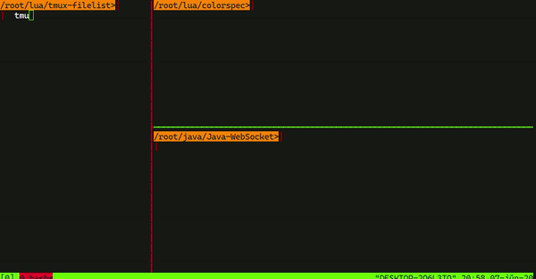

# Tmux-FileTree

Simple, non-intrusive dynamic file tree which always tracks
your active tmux pane. You can install it however you want,
all you have to do is to run the main program in any tmux pane
and it will begin tracking your active pane working directory.

## Installing

Installation is not necessary, but is recommended.

Run `make install` to install tmux-filetree. You can set the
environment variable `PREFIX` to customize installation
directory.

Running tmux-filetree requires any version of Lua or LuaJit on
the path. The installer will detect the most preferable Lua
version and use it to launch tmux-filetree.

## Configuration

The environment variable `TMUX_FILETREE_COMMAND` sets the tree
command you want to use. The string `%s` will be replaced with
the directory that should be displayed.
