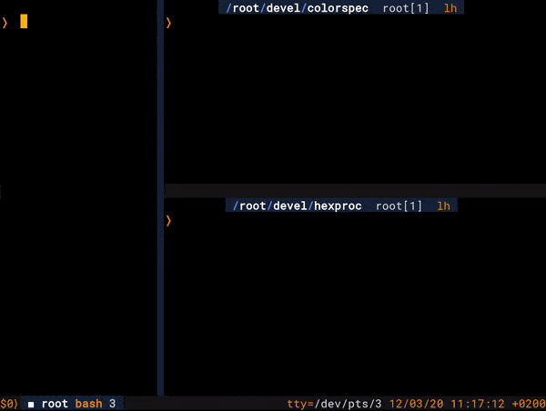

# Tmux-FileTree

Simple, non-intrusive dynamic file tree which always tracks
your active tmux pane. You can install it however you want,
all you have to do is to call the main program in any tmux pane
and it will begin tracking your active pane working directory.

## Installing

Requires Lua 5.1+

Run `make install` to install tmux-filetree. The installer
uses the environment variable `PREFIX` to determine installation
directory.

## Configuration

The environment variable `TMUX_FILETREE_COMMAND` sets the tree
command you want to use. The string `%s` will be replaced with
the directory that should be displayed.
